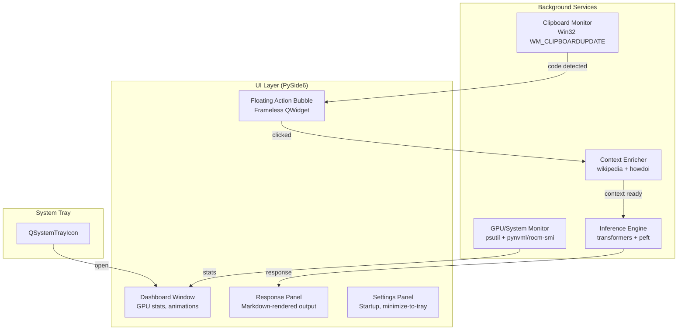

# CodeMate Desktop Application — Implementation Plan

A standalone Python desktop app that runs the fine-tuned **Qwen2.5-Coder-1.5B-Instruct** model locally, monitors the clipboard for code snippets, and provides instant AI-powered code analysis via a floating action bubble and a polished dashboard.

---

## Key Discoveries from Research

| Aspect | Decision |
|---|---|
| **Model format** | The adapter at `/codemate/final_adapter` is a PEFT LoRA (safetensors) on `Qwen/Qwen2.5-Coder-1.5B-Instruct`. We'll load with `transformers` + `peft` for native support — no GGUF conversion needed. |
| **Chat template** | Qwen2.5 uses `<\|im_start\|>system\n...<\|im_end\|>` format (confirmed from `chat_template.jinja`). The user's `<start_of_turn>` format was from the old CodeGemma training script — we must use the correct Qwen chat template. |
| **GPU backends** | NVIDIA → PyTorch CUDA (standard). AMD → PyTorch ROCm (now officially supported on Windows for RX 7000/9000). CPU fallback always available. |
| **UI framework** | **PySide6 (Qt6)** — superior to tkinter for animations, transparency, modern styling, and system tray. |
| **Clipboard** | `pyperclip` + Win32 native `WM_CLIPBOARDUPDATE` listener for event-driven (no polling). |
| **System tray** | PySide6 `QSystemTrayIcon` (built-in, no need for pystray). |
| **Web context** | `wikipedia` package for knowledge context + `howdoi` for StackOverflow code snippets. Lightweight, no API keys, runs in background threads. |
| **Packaging** | PyInstaller with model/adapter shipped as external folder alongside exe (not bundled inside — too large). |
| **Startup registration** | Windows Registry `HKCU\...\Run` key. |

---

## User Review Required

> [!IMPORTANT]
> **Prompt Template Change**: Your training script uses `<start_of_turn>user`/`<start_of_turn>model` (CodeGemma format), but the actual fine-tuned adapter's `chat_template.jinja` and `tokenizer_config.json` confirm Qwen2.5 format: `<|im_start|>system`/`<|im_start|>user`/`<|im_start|>assistant`. I'll use the **correct Qwen2.5 chat template** for inference. Is the system prompt text itself (`SYSP`) still what you want?

> [!WARNING]
> **Model size**: The base model `Qwen2.5-Coder-1.5B-Instruct` is ~3GB at float16 (or ~1.5GB at 4-bit quantized). The adapter is only ~8MB. We'll use **4-bit quantization** (bitsandbytes) for NVIDIA, and float16 for AMD/CPU. The exe itself will be ~50-100MB, but the model folder (~1.5-3GB) ships alongside it. Is that acceptable?

> [!IMPORTANT]
> **AMD ROCm on Windows**: Official PyTorch ROCm support on Windows currently covers **RX 7000/9000 series only**. Older AMD GPUs will fall back to CPU. Is that OK?

---

## Open Questions

1. **Model download**: Should the app auto-download the base model from HuggingFace on first run, or do you want to bundle/pre-download it? Auto-download is simpler for distribution.
2. **Response display**: When the user clicks the floating bubble and the model responds — should the response appear in:
   - A) A floating tooltip/popup near the bubble?
   - B) The main dashboard window?
   - C) Both (popup + logged in dashboard)?
3. **Clipboard trigger scope**: Should the bubble appear for *any* clipboard copy, or only when the copied text looks like code (heuristic detection)?

---

## Architecture Overview



---

## Proposed Changes

All code goes into `c:\Users\Felix\Desktop\genai\codemate_app\`.

### [NEW] Entry Point & Configuration

#### [NEW] [main.py](file:///c:/Users/Felix/Desktop/genai/codemate_app/main.py)
Application entry point. Initializes QApplication, loads settings, starts all background services, creates the system tray icon, and enters the Qt event loop. Handles single-instance locking (prevent multiple instances).

#### [NEW] [config.py](file:///c:/Users/Felix/Desktop/genai/codemate_app/config.py)
Central configuration: model paths, system prompt, generation params (temperature, top_p, max_tokens), context enrichment settings, UI theme constants. Uses `platformdirs` for portable settings path.

---

### Core Engine (`core/`)

#### [NEW] [core/__init__.py](file:///c:/Users/Felix/Desktop/genai/codemate_app/core/__init__.py)
Package init.

#### [NEW] [core/gpu_detector.py](file:///c:/Users/Felix/Desktop/genai/codemate_app/core/gpu_detector.py)
- Detects GPU vendor (NVIDIA via `pynvml`, AMD via `subprocess` calling `rocm-smi` or WMI queries).
- Returns a `GPUInfo` dataclass: `vendor`, `name`, `vram_total`, `driver_version`, `compute_backend` (cuda/rocm/cpu).
- Selects optimal PyTorch device and dtype.

#### [NEW] [core/model_engine.py](file:///c:/Users/Felix/Desktop/genai/codemate_app/core/model_engine.py)
- Loads `Qwen2.5-Coder-1.5B-Instruct` base + LoRA adapter using `transformers` + `peft`.
- NVIDIA: uses `BitsAndBytesConfig` 4-bit NF4 quantization.
- AMD/CPU: uses float16 or float32 fallback.
- Exposes `async generate(code: str, context: str) -> str` method.
- Formats prompt using correct Qwen2.5 chat template:
  ```
  <|im_start|>system
  {SYSP}<|im_end|>
  <|im_start|>user
  <CODE>
  {code}
  </CODE>

  CONTEXT: {web_context}<|im_end|>
  <|im_start|>assistant
  ```
- Runs inference in a `QThread` to avoid blocking UI.

#### [NEW] [core/clipboard_monitor.py](file:///c:/Users/Felix/Desktop/genai/codemate_app/core/clipboard_monitor.py)
- Uses Win32 API (`ctypes`) to register for `WM_CLIPBOARDUPDATE` events (no polling).
- Runs in a background `QThread`.
- Emits Qt signal `clipboard_changed(text: str)` when new text detected.
- Basic heuristic to detect code-like content (presence of `def`, `class`, `{`, `import`, `=`, indentation, etc.).

#### [NEW] [core/context_enricher.py](file:///c:/Users/Felix/Desktop/genai/codemate_app/core/context_enricher.py)
- Extracts keyword batches from code:
  - For code <50 tokens: 1 batch (first few words).
  - 50-200 tokens: 3 batches (start, middle, end).
  - 200+ tokens: 5 batches (evenly distributed).
- Strips common language keywords (`def`, `return`, `import`, `if`, `for`) — searches for *meaningful* identifiers.
- Queries `wikipedia` API for summaries (max 2 sentences each).
- Queries `howdoi` for StackOverflow snippets.
- Runs all queries in parallel via `concurrent.futures.ThreadPoolExecutor`.
- Assembles concise context string (capped at ~300 tokens to not overwhelm the model).

#### [NEW] [core/system_monitor.py](file:///c:/Users/Felix/Desktop/genai/codemate_app/core/system_monitor.py)
- Periodic (1s) system stats collection via `psutil` + `pynvml`/`rocm-smi`.
- Tracks: CPU%, RAM usage, GPU utilization%, GPU memory used/total, GPU temp.
- Emits Qt signals with updated stats for dashboard consumption.

#### [NEW] [core/startup_manager.py](file:///c:/Users/Felix/Desktop/genai/codemate_app/core/startup_manager.py)
- Manages Windows startup registration via `winreg` (Registry `HKCU\Software\Microsoft\Windows\CurrentVersion\Run`).
- `enable_startup()` / `disable_startup()` / `is_enabled()`.

---

### UI Layer (`ui/`)

#### [NEW] [ui/__init__.py](file:///c:/Users/Felix/Desktop/genai/codemate_app/ui/__init__.py)
Package init.

#### [NEW] [ui/theme.py](file:///c:/Users/Felix/Desktop/genai/codemate_app/ui/theme.py)
Design system: color palette (dark mode primary), fonts, border radii, animation durations. Applied as QSS (Qt Stylesheets).

#### [NEW] [ui/tray_icon.py](file:///c:/Users/Felix/Desktop/genai/codemate_app/ui/tray_icon.py)
- `QSystemTrayIcon` with context menu: "Open Dashboard", "Settings", "Quit".
- Handles close-to-tray behavior (intercepts `QCloseEvent`).

#### [NEW] [ui/floating_bubble.py](file:///c:/Users/Felix/Desktop/genai/codemate_app/ui/floating_bubble.py)
- Frameless, always-on-top, semi-transparent circular `QWidget`.
- Appears near the cursor when clipboard code is detected.
- Pulse animation (glow effect) to draw attention.
- Click triggers inference pipeline.
- Auto-hides after 5 seconds if not clicked.
- Shows a small spinner animation while model is processing.

#### [NEW] [ui/dashboard.py](file:///c:/Users/Felix/Desktop/genai/codemate_app/ui/dashboard.py)
Main window with:
- **Header**: App title + logo + status indicator (model loaded/loading/error).
- **GPU Stats Panel**: Animated circular gauges for GPU utilization, GPU memory, CPU%, RAM%.
- **System Info Cards**: GPU name, driver version, VRAM total, compute backend, model status.
- **Recent Activity Log**: Scrollable list of recent clipboard analyses with timestamps.
- **Settings Toggle Panel**: Start-at-startup checkbox, minimize-to-tray toggle.

#### [NEW] [ui/response_popup.py](file:///c:/Users/Felix/Desktop/genai/codemate_app/ui/response_popup.py)
- Frameless popup window that appears when inference completes.
- Renders model response with syntax highlighting (using `QSyntaxHighlighter` or simple HTML).
- Copy-to-clipboard button for the response.
- Draggable, dismissible.

#### [NEW] [ui/widgets/gauge_widget.py](file:///c:/Users/Felix/Desktop/genai/codemate_app/ui/widgets/gauge_widget.py)
Custom animated circular gauge widget using `QPainter`. Smooth arc animation via `QPropertyAnimation`. Used for GPU util, memory, CPU, RAM on the dashboard.

#### [NEW] [ui/widgets/stat_card.py](file:///c:/Users/Felix/Desktop/genai/codemate_app/ui/widgets/stat_card.py)
Glassmorphism-styled info card with icon, label, and animated value counter.

---

### Assets

#### [NEW] [assets/icon.png](file:///c:/Users/Felix/Desktop/genai/codemate_app/assets/icon.png)
App icon (will generate using image generation tool).

#### [NEW] [assets/icon.ico](file:///c:/Users/Felix/Desktop/genai/codemate_app/assets/icon.ico)
Windows ICO format for tray + exe.

---

### Build & Packaging

#### [NEW] [requirements.txt](file:///c:/Users/Felix/Desktop/genai/codemate_app/requirements.txt)
```
torch>=2.2.0
transformers>=4.40.0
peft>=0.10.0
bitsandbytes>=0.43.0
accelerate>=0.30.0
PySide6>=6.7.0
psutil>=5.9.0
pynvml>=11.5.0
wikipedia>=1.4.0
howdoi>=2.0.0
pyperclip>=1.8.0
platformdirs>=4.0.0
pyinstaller>=6.0.0
```

#### [NEW] [build.spec](file:///c:/Users/Felix/Desktop/genai/codemate_app/build.spec)
PyInstaller spec file. Collects hidden imports for `transformers`, `torch`, `peft`. Bundles assets. Model folder ships alongside exe (not inside).

#### [NEW] [build.py](file:///c:/Users/Felix/Desktop/genai/codemate_app/build.py)
Build script that:
1. Runs PyInstaller with the spec file.
2. Copies model files to `dist/codemate_app/model/`.
3. Produces final distributable folder.

---

## File Tree (Final)

```
codemate_app/
├── main.py                          # Entry point
├── config.py                        # Configuration
├── requirements.txt                 # Dependencies
├── build.spec                       # PyInstaller spec
├── build.py                         # Build helper
├── core/
│   ├── __init__.py
│   ├── gpu_detector.py              # GPU vendor detection
│   ├── model_engine.py              # Inference engine
│   ├── clipboard_monitor.py         # Win32 clipboard listener
│   ├── context_enricher.py          # Wikipedia/SO context
│   ├── system_monitor.py            # GPU/CPU stats
│   └── startup_manager.py           # Windows startup reg
├── ui/
│   ├── __init__.py
│   ├── theme.py                     # Design system / QSS
│   ├── tray_icon.py                 # System tray
│   ├── floating_bubble.py           # Floating action circle
│   ├── dashboard.py                 # Main dashboard window
│   ├── response_popup.py            # Inference result display
│   └── widgets/
│       ├── gauge_widget.py          # Animated circular gauge
│       └── stat_card.py             # Glassmorphism stat card
└── assets/
    ├── icon.png                     # App icon
    └── icon.ico                     # Windows ICO
```

---

## Verification Plan

### Automated Tests
1. **GPU Detection**: Run `gpu_detector.py` standalone → verify correct vendor/backend detection.
2. **Model Loading**: Run `model_engine.py` standalone → verify model + adapter loads, inference produces output.
3. **Context Enricher**: Run with sample code → verify Wikipedia/howdoi queries return relevant context.
4. **Clipboard Monitor**: Run monitor → copy text → verify signal fires.

### Manual Verification
1. **Full App Test**: Launch `main.py` → verify dashboard appears with live GPU stats and animations.
2. **Clipboard Flow**: Copy a code snippet → verify floating bubble appears → click → verify response popup with model output.
3. **Tray Behavior**: Close window → verify minimizes to tray → right-click tray → verify menu works.
4. **Startup Toggle**: Enable startup → verify registry key created → disable → verify removed.
5. **Build Test**: Run `build.py` → verify standalone exe launches correctly.
